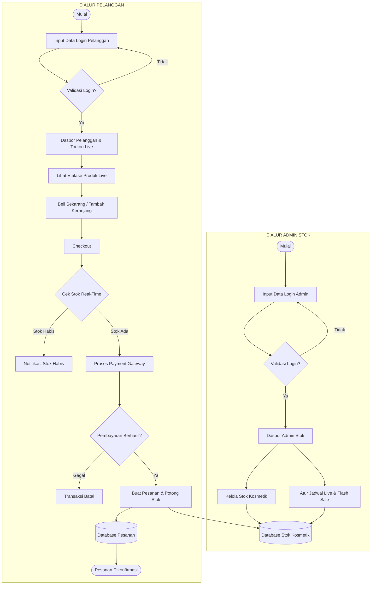

# Dokumentasi Arsitektur Sistem — Live Shopping Kosmetik

Dokumen ini berisi diagram alur interaksi antara **Admin Stok** dan **Pelanggan** pada sistem *Live Shopping & Flash Sale* Produk Kosmetik.

## Diagram Alur Sistem (Flowchart)

