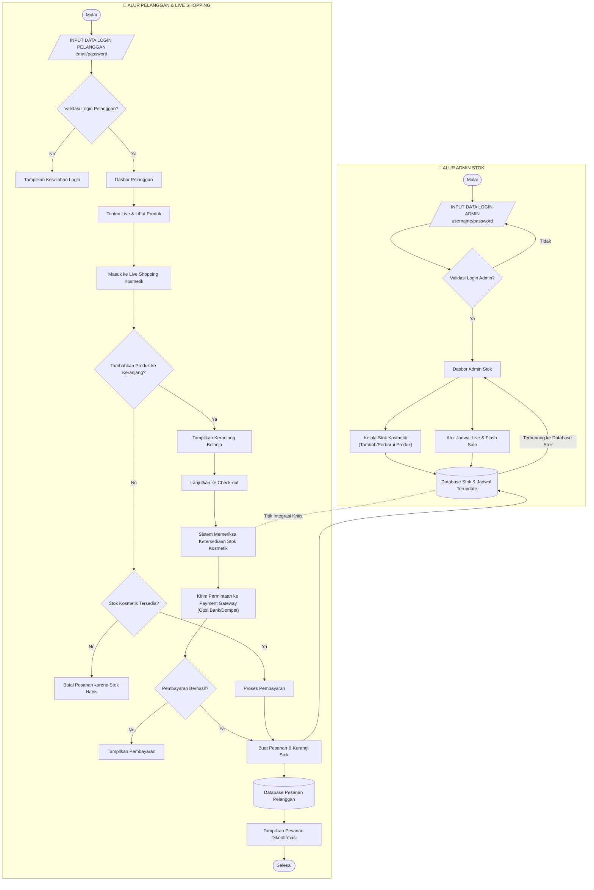

# Dokumentasi Arsitektur & Alur Sistem — Live Shopping Kosmetik

Dokumen ini memuat diagram alur (*flowchart*) integrasi antara **Alur Admin Stok** dan **Alur Pelanggan (Live Shopping & Purchase)**.

---

## Ringkasan Titik Integrasi Kritis (Architecture Decision)

1. **Sinkronisasi Stok Real-Time:** `Sistem Memeriksa Ketersediaan Stok Kosmetik` terhubung langsung ke `Database Stok & Jadwal Terupdate` milik Admin untuk mencegah *overselling* saat Flash Sale.
2. **Pemisahan Database (CQRS/Isolation):** Transaksi yang berhasil akan langsung memperbarui `Database Stok Admin` sekaligus mencatat histori transaksi di `Database Pesanan Pelanggan`.
